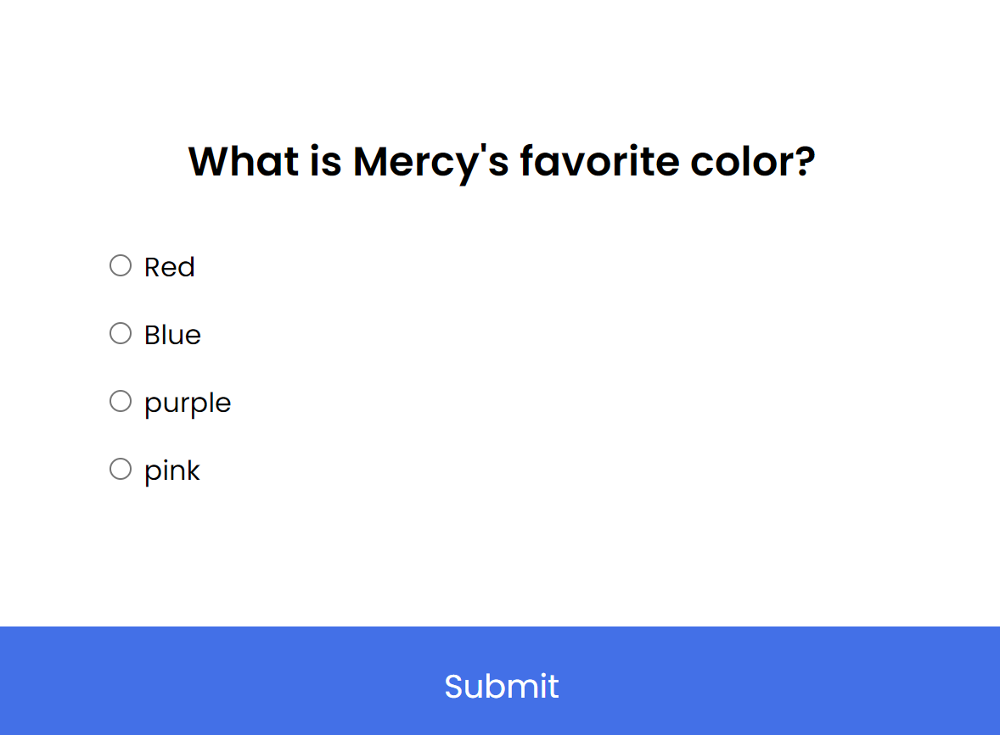

# quizapp
This is a quiz app about me that allows you to take a quiz to get to know me a little better. The app prompts you with a question followed by a list of potential answers you can choose from. Upon submission of all questions, you will get the results of the quiz.

## How to use
To use this app, simply follow these steps:

1. Clone this repository to your local machine.
2. Open the app in your preferred code editor.
3. Run the app.
4. Read the question.
5. Click on the answer that you would like to choose.
6. Click submit to go to the next question, or if final question, click submit to get results.
7. Click try again to redo the quiz.

## Technologies used
This app was built using the following technologies:

HTML
CSS
JavaScript
Credits
This app was created with the help of a YouTube tutorial, which can be found https://www.youtube.com/watch?v=dtKciwk_si4.
